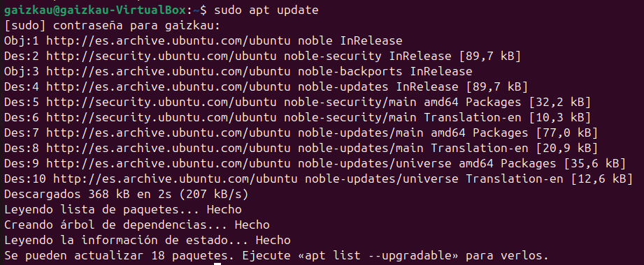
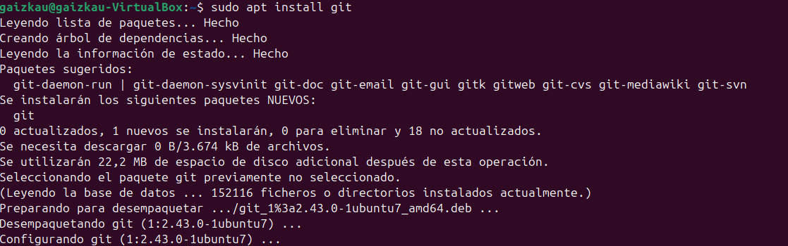
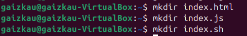
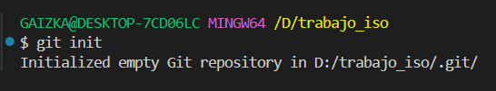
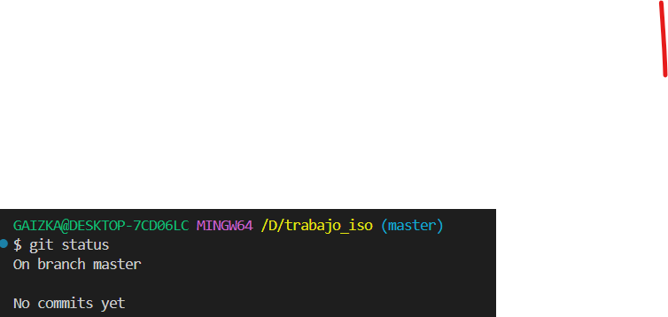

# Cómo utilizar Git en un Proyecto

## Motivación

Git es una herramienta poderosa para el control de versiones que permite a los desarrolladores gestionar y seguir los cambios en sus proyectos de manera eficiente. Usar Git ofrece numerosas ventajas:

- **Historial de Cambios**: Puedes ver qué cambios se realizaron, cuándo y por quién.
- **Deshacer Errores**: Puedes revertir tu proyecto a un estado anterior si algo sale mal.
- **Colaboración**: Facilita el trabajo en equipo, permitiendo que múltiples desarrolladores trabajen en el mismo proyecto sin conflictos.

## Instalación de Git
Para instalar Git en un sistema Ubuntu, sigue estos pasos:

1. **Actualizar el sistema**:

2. **Instalar Git**:

 **Configurar tu nombre de usuario y correo electrónico**:
    
    
    
3. **Creacion proyecto**:
     

4. **Inicializacion**: 
    - **Inicilaizar el repositorio**
     
    - **Agregar el archivo al repositorio**
      

## Flujo de Trabajo 
- **Abrir el index.html y poner un parrafo**
   
   
- **Guardar los cambios y verificar el estado del repositorio**
       

    
